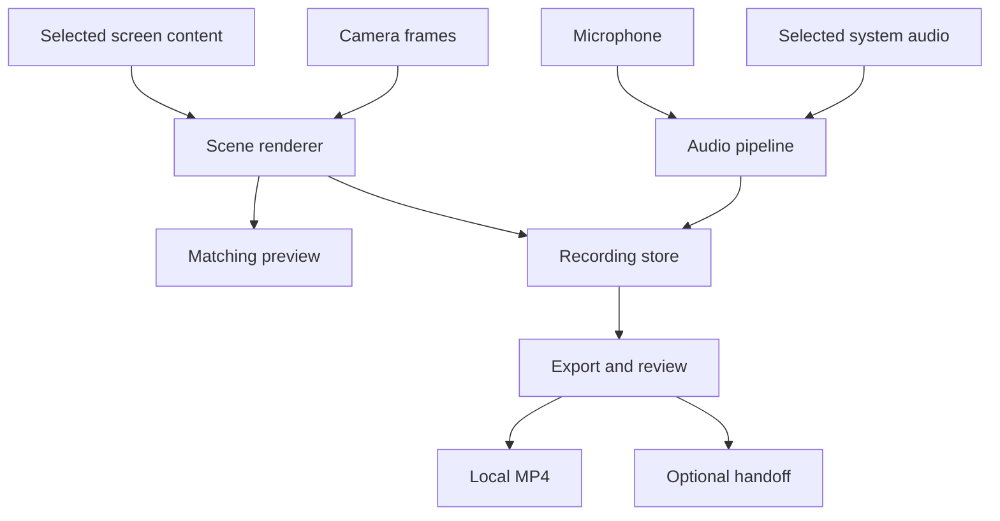

# Architecture

This is a proposed design. Platform behavior and recovery guarantees require the M0/M1 experiments in [ROADMAP.md](ROADMAP.md).

## Boundaries

Build a native Swift app with AppKit for menu-bar/panel behavior and SwiftUI where it simplifies regular settings and library views. Use ScreenCaptureKit, AVFoundation, and hardware-supported encoding. Split responsibility into small modules; keep third-party dependencies minimal and justified. A thin Xcode application target owns signing and entitlements; a Swift package contains testable core logic. Pin the Xcode/SDK and Swift language mode after M0.

| Component | Responsibility |
|---|---|
| CaptureCoordinator | Session lifecycle, commands, permissions, interruption policy, and exclusive ownership |
| ScreenSource / CameraSource | Device/source selection and bounded media delivery |
| AudioPipeline | Track capture, clock mapping, resampling, and optional processing |
| SceneRenderer | Capture geometry, clean screen plus camera composition, and matching preview |
| RecordingStore | Media writers, journal, checkpoints, crash recovery, and file integrity |
| ExportService | Edits, audio mix, standard MP4 export, and playable-output validation |
| ClipCatalog | Local discovery and search; rebuildable from recording manifests |
| HandoffService | Destination copies, durable jobs, retries, and truthful completion states |
| AutomationAdapter | Local CLI and events using the same commands as the UI |

The proposed initial target is macOS 14+ on Apple Silicon. M0 checks SDK availability and a fresh install on the oldest supported OS. A newer API must have a tested fallback or an explicit higher support floor. Intel is supported only after its own build and hardware test. Browser portability lives in data formats and contracts; native media code is not forced through a browser abstraction.

## Media flow

Exclude Eidos Clips windows from screen capture, then composite the camera exactly once. Use one scene description for preview and encoded output. This supports screen, window, and region capture without depending on the bubble itself being present inside the captured OS window.

Coordinate conversion must cover logical points, pixel scale, display origins (including negative coordinates), selected source bounds, and output pixels. Keep placement normalized to the selected capture. Source resizing/monitor removal must pause or make an explicit supported adjustment; never continue capturing an unrelated area. Refresh exclusions for newly opened app windows and inspect encoded frames to prove that panels, dialogs, and menus do not leak. Do not rely solely on window sharing flags.

M0 compares the existing direct-capture bubble technique with explicit composition. Explicit composition is the proposed choice because it supports all capture scopes. Keep a simpler display-only implementation for the M1 internal build if the renderer is not ready; the public scope requires M2's complete geometry proof.

Apple provides screen, system-audio, microphone, and direct recording capabilities in newer ScreenCaptureKit APIs. Evaluate the newer microphone output behind availability checks. Direct recording output is an option for simple sessions only if it satisfies pause, track, composition, and recovery requirements; it does not replace those requirements by itself. [Apple's ScreenCaptureKit session](https://developer.apple.com/videos/play/wwdc2024/10088/)

## One lifecycle owner

CaptureCoordinator serializes transitions. UI work runs on the main actor; encoding and file IO run on dedicated bounded queues. Real-time audio callbacks never perform file IO, block on a mutex held by other work, resize arrays, or await actors. Preallocated buffers bridge audio into the writer path with explicit overflow accounting.

| State | Permitted next states | Required behavior |
|---|---|---|
| idle | preparing | Validate sources, destination, permissions, and disk space |
| preparing | recording, idle, failed | Repeated Start is rejected; cancellation cleans up all devices/writers |
| recording | paused, interrupted, finalizing, failed | Timer derives from the common media timeline |
| paused | recording, interrupted, finalizing, failed | No paused samples retained in any track |
| interrupted | preparing, finalizing, failed | Reacquire sources only after an explicit resume |
| finalizing | ready, recoverable, failed | Stop is idempotent; no new capture in this session |
| ready | idle | Verified local original can be reviewed; exports/jobs have separate state |
| recoverable | ready, failed | Retain partial material and report recovered bounds |
| failed | idle, recoverable | Preserve useful evidence and media; show the actual error |

All entry paths—button, shortcut, CLI, source-ended callback, Quit—use this owner. Stop and callbacks converge on one finalization operation. Drain accepted buffers before marking inputs finished. Check start/append/finalization results and writer status. “Saved” requires confirmed media completion and successful read-back of expected tracks/duration. A valid partial session is labeled interrupted or recovered, never silently called complete. Apple's finalization API requires querying writer status to determine success. [AVAssetWriter finalization](https://developer.apple.com/documentation/avfoundation/avassetwriter/finishwriting(completionhandler:))

## Clock and audio decisions

Use one monotonic host timeline with an explicit session origin and a single accumulated pause interval applied to every track. Record pause transitions at command time, not at arrival of the next video frame. Handle first audio before first video, static screens, late samples, and resume ordering. Wall-clock changes must not alter media duration.

Retain microphone and selected system audio independently in the recording package. Create an ordinary mixed AAC track during export so common players hear both. Device sample rates/channel layouts are explicit; resampling occurs outside the real-time callback and measured drift is corrected against the common clock.

Remove unconditional microphone ducking. Offer echo processing only where the hardware path is validated; record processing mode and gaps in the manifest. Test double-talk on speakers, headphones, and Bluetooth. Separate tracks allow balance repair but do not retroactively remove acoustic echo, so a successful mix is not evidence of successful cancellation. Device disconnect pauses by default; the user may intentionally select a replacement or continue without that input.

## Local storage and recovery

Use a visible default root at `~/Movies/Eidos Clips`, configurable through a native picker. Each recording gets a collision-resistant ID and a `.eidosclip` directory package. Store a versioned JSON manifest, recoverable media, a small journal, thumbnail, and edit descriptions. File and media references are relative to the package. Exported MP4s live in a separate user-selected destination or the default Exports folder.

M0 chooses between fragmented media with verified journal checkpoints and independently finalized segments. Prototype both only far enough to choose one from process-kill/reopen evidence. Prefer the simpler proven design. Apple documents movie fragments for partially written media; this is not by itself a guarantee about every abrupt termination, codec, or power-loss scenario. [Movie fragment interval](https://developer.apple.com/documentation/avfoundation/avassetwriter/moviefragmentinterval)

Target checkpoint spacing: at most ten seconds. Commit media before the journal says it is recoverable, with the required flush/fsync behavior measured on supported local storage. Atomically replace manifests using a temporary file on the same volume. On launch, scan unfinished packages, reconcile journal/file mismatches, decode verified media, and recover to a new artifact without overwriting the original. Preserve malformed tails for possible repair. Power-loss guarantees require separate testing; do not infer them from process-kill tests.

Normal exports use temporary files on the destination volume and an atomic rename after validation. Cross-volume operations are copy → verify → finalize, preserving the source. Check free space for capture, retained tracks, export, and transient duplication. Report estimates, not a falsely exact time remaining. On low space stop safely while the reserved finalization budget remains. Limit export concurrency so it cannot starve an active recording.

Default retained video is the composed screen/camera view plus separate audio tracks. Keeping independent screen and camera originals is a later opt-in mode with a visible storage estimate. Post-recording camera reposition/removal is unavailable for recordings without those sources. Trims are edit decisions and never mutate the original.

The manifest is authoritative. Begin with a filesystem-backed catalog and a rebuildable index; add SQLite/FTS only when measured library size or search needs justify it. Do not introduce a remote database for basic recording, library use, or export.

## Handoff, privacy, and infrastructure

Capture and export need only the Mac and its disk. A generic synced-folder handoff writes a verified copy and reports **Copied to folder**. It cannot prove remote upload, remote durability, or recipient access. Automatic eviction is absent from 1.0. Do not interpolate destination paths into shell scripts.

Optional later providers may report **Uploaded** after provider confirmation and **Link ready** only after they return a usable share URL with known access scope. They may target user-owned storage, including a future S3-compatible adapter; no storage vendor or hosting platform is required. Credentials belong in the OS credential store, not manifests or logs. Keep credentials and destinations separate for each user-selected profile. No personal account details are embedded in this plan.

Persist operation state and local events rather than adding an in-app notification inbox. Status stays near the active recording or clip. Diagnostics remain local unless explicitly exported and should exclude captured content, secrets, and unnecessary window titles/absolute paths. An update check is opt-in and separate from capture; product copy must not claim zero network activity while an online option is enabled.

## Browser edition boundary

M6 uses browser capture APIs, capability detection, and the same manifest/event concepts. Replace unbounded chunk retention with ordered durable writes to OPFS, track quota, request persistent storage where supported, and provide a clear export action. Browser storage can be cleared or evicted; label a browser draft differently from a user-visible exported file. [OPFS constraints](https://web.dev/articles/origin-private-file-system)

MediaRecorder chunks are not necessarily independently playable. Preserve initialization/container metadata and order, then prove reconstruction for each supported format and interruption point. A short timeslice is not a durability guarantee and may be delayed. [MediaStream Recording API](https://developer.mozilla.org/en-US/docs/Web/API/MediaStream_Recording_API), [dataavailable timing](https://developer.mozilla.org/en-US/docs/Web/API/MediaRecorder/dataavailable_event)

If a format cannot be recovered reliably, disable recovery claims for it and offer a tested mode. Never silently fall back to unlimited memory. System audio and floating preview depend on browser/OS support. Do not promise invisible browser chrome or a correct floating bubble on arbitrary monitors; disable unsupported configurations. Any local launcher binds explicitly to loopback, serves an allowlisted asset root, and handles port conflicts without opening an unrelated server.
