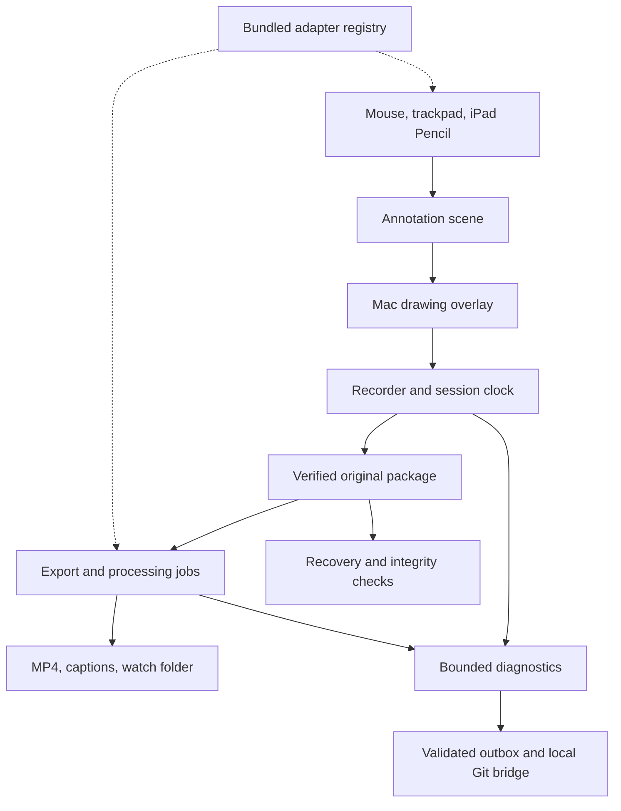

# Executable build plan

Daniel authorized the full feature map, active implementation and pushing to main on September 6, 2026. This plan owns delivery status; it does not turn proposed capabilities into a false completion claim. The [57-feature inventory](FEATURE-MAP.md) and [machine-readable ledger](feature-map.json) preserve every stable feature ID. [LOOM-GAPS.md](LOOM-GAPS.md) preserves the wider opportunity list.

## Implemented application boundaries



The recorder owns permissions, lifecycle, timing, required tracks, Stop and durable media. Finishing the recording precedes a separate cancellable preview export. Drawing input never receives recording commands. Editors/processors/destinations receive an immutable input reference and an explicit output location. Basic recording, playback and MP4 export remain available with optional modules disabled.

`ClipsModules` is the versioned shared contract target. `ExtensionRegistry` registers actual protocol implementations and resolves them by capability. It has separate drawing, editor, export, processor and destination collections. These are trusted bundled modules in one process. There is no downloadable Swift/native library loader, sandbox claim, marketplace or untrusted executable SDK.

## Delivery ledger

| Slice | Code delivered | Executable evidence | Still open |
|---|---|---|---|
| Compact capture | 420-point ready panel, floating strip, include Clips UI, area picker, stable display ID | Native renders and region bounds tests | Actual display/crop/window inclusion on physical Mac |
| Capture control | Cancellable countdown/preparation, remembered input choices, mic/camera selectors, global shortcuts, separate recording meters, explicit input/display-loss and sleep interruption | Compile and shortcut registration evidence | Preflight meter/test flow, device hot-plug, live mute/camera controls, lock and sleep matrix |
| Optional annotation | Portable ordered strokes, pointer adapter, pen/highlighter/eraser, undo/clear, laser, whiteboard, drawing exit, local sidecars | State/epoch/bounds tests, native adapter/render/disable checks | Pencil feel/latency, physical capture, editable ink re-render, full sidecar crash durability |
| Paired iPad | Native UIKit Pencil/finger canvas, encrypted nearby connection, code confirmation on both devices, scoped preview, input-only capability | Shared-channel cryptographic tests, Mac/iPad compilation; simulator evidence separately recorded | Real pairing, Pencil, palm rejection, network switching, reconnection and preview latency |
| Editing/export | Separate adapter/job gate, progress/cancel, trim or remove middle, saved recipe, original retained | Decoded frame/duration checks, cancellation/stale gate | Persistent queue, stitch, full timeline, long jobs under resource pressure |
| Review/library | Playback, title, thumbnails/search, verified preview reuse, notes, chosen root, Recently Deleted/undo | Native fixture views and source integrity tests | Project taxonomy, cache retention, notes/transcript search, large collections |
| Captions processor | SRT/WebVTT import, native playback captions, export time remapping | Parser/mapping/escaping tests | Automatic transcription, speaker labels, word editing, provider adapters |
| Destinations | Verified local copy with idempotent retry, native Share, standalone watch folder | Native digest/copy/retained-original tests | Named destinations, durable retry queue, hosted URL, access/revoke, comments, reactions, analytics |
| Diagnostic loop | Typed bounded JSONL, recording correlation, outbox/report validator, local-agent Git bridge | Swift/Python content rejection tests | Real user incident → published report → fix → physical regression loop; provider timing depth |
| Distribution | Separate development app, company signing/notarization script, iPad Xcode project | CI development-signature verification | Execute company signing on its Mac, iPad provisioning and clean-device installs |

## Execution order from this checkpoint

1. **Keep the native build green.** Compile the app and companion, run contract/media/recovery tests, render real native views. Correct failures before advancing main. Record exact source SHA and artifacts in BUILD-REVIEW.md.
2. **Qualify the physical loop.** On a signing-capable Mac, record display + microphone, choose a region on each display, pause, draw, finish, review and export. Pair a provisioned iPad; confirm both codes; draw with Pencil; check exported video; disconnect and continue recording. Measure latency and A/V offsets. These require actual hardware and cannot be completed by this Linux authoring environment or synthetic fixtures.
3. **Close reliable capture gaps.** Add preflight input meters/test capture, window selection/preview, live mute/camera controls, device/display loss policy, true source-border proof and two-hour qualification. Preserve failure-safe required-input semantics.
4. **Complete daily-workflow scale.** Add project/search metadata, cache size/retention, persistent export/delivery jobs, named destinations, stitch and the documented manifest/orphan-repair procedure. Keep originals immutable and deletion recoverable.
5. **Add chosen provider modules.** Transcription, privacy processing, hosted watch links, explicit access/revoke, timestamp comments and reactions, optional view analytics. A local watch folder is not a hosted service. No destination account, cloud backend, credentials or upload permission is invented in this implementation.
6. **External ecosystem after containment.** Publish a compatibility policy and conformance kit; add a supervised process boundary and enforced file/network/resource grants before loading third-party code. Other tablet/browser input adapters can use the portable ink protocol without changing the recorder.

## Local agent: build and finish device evidence

Fetch current main into a clean isolated checkout. Run `swift test`, `bash scripts/build-app.sh`, and `bash scripts/build-companion.sh`. The last command builds for Simulator; it does not provision an iPad.

Open `Companion/ClipsDraw.xcodeproj` in Xcode on the Mac, use the existing Eidos development team/provisioning, and run ClipsDraw on the iPad. On the Mac use the ready-panel menu or recording-strip iPad button → Find drawing device. On iPad choose Find my Mac. Compare codes and confirm on both devices. Start recording on the Mac; enable preview explicitly if wanted. Draw; pause/resume; disconnect. Save physical evidence locally, with content-free measurements in the diagnostic report. No real recording should be committed to the public repo.

For the macOS distributable run `bash scripts/release-app.sh` on the existing signing Mac; see LOCAL-AGENT.md and SIGNING.md. Retain the source SHA, signing/notary result, Gatekeeper evidence and final archive SHA. Never turn an ad-hoc ZIP into a claimed installable release.

For diagnostics, the app menu → Save diagnostic report. The local agent can first validate, then publish using its existing Git credentials:

```sh
python3 scripts/diagnostics-agent.py --repo /absolute/path/to/eidos-clips
python3 scripts/diagnostics-agent.py --repo /absolute/path/to/eidos-clips --publish
```

The second command is the explicit publication action. It writes `diagnostics/local-reports`, verifies the remote commit and moves acknowledged packets to `Sent`. It does not touch main, open an issue/PR or message another person. It does not install a background scheduler. A concurrent push fails safely and leaves reports available for retry.

## Completion rule

A feature is implemented when there is a reachable application path, a defined failure outcome and appropriate executable checks. Hardware-dependent acceptance stays open until physical evidence exists. The broad roadmap also contains unimplemented product features; no entire M0–M5 milestone is closed merely because a new app compiles.
