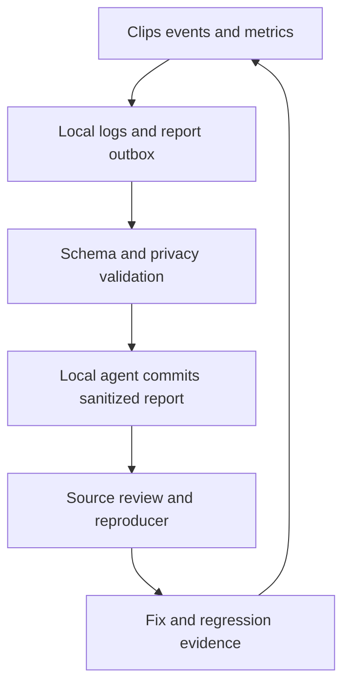

# Structured diagnostics and repository feedback

## Implemented packet and transport

`Sources/ClipsModules/Diagnostics.swift` defines the actual version-1 schema. The envelope is `schemaVersion`, `reportID`, `runID`, `sourceCommit`, `hardwareValidated:false`, and `records`. Each record has an allowlisted event, sequence, relative milliseconds, optional operation/recording UUID and an allowlisted numeric metrics dictionary. There is no arbitrary string payload API. The larger examples/coverage table below are the target design, not fields currently permitted by the public validator.

Local JSONL writes occur on a utility queue, flush every second and fsync; the last unflushed second may be lost on a crash. Ingress/recent buffers are bounded. Explicit report creation and normal termination flush pending records. The implemented caps use decimal bytes: 10,000,000 per log, approximately 100,000,000 total, seven days, 2,048 recent records, 20 pending reports, 5,000,000 bytes per report.

The outbox is `~/Movies/Eidos Clips/Diagnostic Outbox`, independent of a custom recording root. The app never holds a GitHub token. `scripts/diagnostics-agent.py --repo PATH --publish` is the local-agent publication path. Its tests exercise real local Git worktrees, branch publication, idempotent retry and collision refusal against a bare fixture repository; no GitHub diagnostic report was uploaded by those tests. Actual local-agent credentials and a real incident remain needed for a production feedback cycle.


> **Implementation update — September 6, 2026:** Executable code now implements the compact capture, modular tools, local drawing, native iPad companion, editing/destination and diagnostic paths described in [BUILD-PLAN.md](BUILD-PLAN.md). Use [FEATURE-MAP.md](FEATURE-MAP.md) for current feature status and [BUILD-REVIEW.md](BUILD-REVIEW.md) for exact proof. Historical “missing/proposed” statements below describe the earlier baseline unless listed as still open in that ledger. Physical and signing acceptance are not implied.


**Design for discussion; not implemented.** Requested by Daniel on September 6, 2026. Links: [D01–D03 in the feature map](FEATURE-MAP.md), [WANT.md](WANT.md), [local agent handoff](LOCAL-AGENT.md). The goal is enough evidence to understand failures and bottlenecks, reproduce them, and prove a fix without repeatedly asking Daniel to collect console output.

## The complete loop



Clips records facts and prepares reports. The existing local agent handles authenticated Git operations. This preserves the ability to replace the coding agent and keeps repository write credentials out of the recorder. No agent, model call, GitHub token, or network service is required to capture/export a video.

## Event envelope

Use versioned JSON Lines. Event names and fields come from a fixed schema, not arbitrary string dictionaries. A recording ID links capture, writer, export and UI actions; a distinct operation ID links each export/recovery/handoff. Include sequence numbers and monotonic elapsed time so missing events, queue delays and clock changes are observable.

Example of the intended public-safe metric shape; these values are illustrative, not measured:

```json
{
  "schemaVersion": 1,
  "event": "encoder.wait_summary",
  "sourceCommit": "1eaf230f7ff0ed3609c66ddfe328fd5b456006cd",
  "buildVersion": "0.2.0",
  "runID": "7da7b529-6bfc-4d40-b49f-f91262e42eae",
  "sessionID": "208b7a61-ece7-4614-a12d-5fd64e829632",
  "operationID": "e915f916-111e-4f9e-bfe5-a0d5ea2dd0b0",
  "sequence": 412,
  "elapsedMs": 23140,
  "featureID": "R03",
  "track": "video",
  "count": 59,
  "waitMsTotal": 121,
  "waitMsMax": 45,
  "waitHistogramMs": {"0to1": 40, "1to5": 15, "5to20": 3, "over20": 1},
  "queueDepthMax": 12,
  "outcome": "ok"
}
```

Record wall-clock timestamps locally when useful. Repository reports use relative time, fresh random report/session IDs, and coarse environment fields; exclude persistent machine/user identifiers and activity schedules. Dirty/local builds must be labeled as such rather than falsely identifying a clean source commit.

## Coverage: instrument successes as well as failures

| Area | Events and structured facts | Question the agent can answer |
|---|---|---|
| App/UX | Launch/ready, surface opened/closed, command entry point (panel/menu/shortcut), requested/accepted/rejected action, prior/next state, result code | Was a click ignored, disabled, rejected or waiting on work? |
| Permissions/devices | Required capabilities, grant/deny state, device class, route change/loss, selected-source availability | Did setup fail on permissions, a missing input, or a changed device? |
| Capture configuration | Full display/region, numeric bounds/scale, output width/height/fps/pixel format, filter policy, selected track kinds, process-audio exclusion | Did the recording use the intended crop and configuration? |
| Start readiness | Start requested, permission work duration, device/stream readiness, first usable video/mic/system sample elapsed time, timeout | Why did setup take so long, and which requested input never arrived? |
| Frame delivery | Complete/idle/blank/suspended/invalid frame counts, cadence-held frames, gaps, queue depth, append counts by track | Was the screen static, capture incomplete, or the pipeline dropping behind? |
| Encoder | Readiness wait count/histogram/max/total, append duration, capacity/overload, status and bounded error code | Is the encoder, ingress queue, or input cadence the bottleneck? |
| Segments/storage | Open/seal/decode/commit durations, size/duration/sample counts, free-space bucket, write/fsync errors, last verified checkpoint | How much is safely retained and where is storage slow? |
| Lifecycle | Pause/resume/stop requested and applied, rejected repeat commands, Quit, interruption cause, finalization elapsed time, terminal result | Was there one owner and one truthful completion? |
| Export/recovery | Requested trim bounds/duration, verified segment counts, composition/encode/decode/rename timing, failure code, source-preserved result | Did the delay come from opening, exporting, decoding, or finalizing? |
| Library/playback | Scan/thumbnail/open/first-frame/seek latency, result counts, missing/corrupt entry counts, repeated-export count | Does the library get slower or consume more storage during ordinary use? |
| Resource health | Periodic RSS/CPU, available-space bucket, accumulated media/log bytes, dropped-event count, log write latency | Is memory growing with duration? Does diagnostics itself slow capture? |
| Future delivery | Copy/verify/retry transitions, destination class, byte counts, local/remote confirmation state | Did the file copy locally, upload remotely, or actually become accessible? |
| Drawing input adapter / paired companion | Pairing outcome code, target epoch, preview age, stroke-batch counts, transport RTT, Mac receive/render timing, queue drops/reconnect count, stale-message rejection | Is drawing late, incorrectly mapped or disconnected? Never include stroke coordinates, handwriting, preview images, peer identifiers or pairing material |
| Extension host/jobs | Adapter ID/version/contract, capability classes, operation/source revision, handshake/queue/wait timing, cancellation/deadline, stale result, validation/disable reason | Which adapter slowed or failed, and did the host preserve the recording and reject incorrect results? |
| Diagnostics pipeline | Report queued/validated/rejected/committed, packet digest, retry reason and returned Git SHA | Did useful evidence reach the repo exactly once? |

Do not log video/audio samples, thumbnails, transcripts, clip titles, app/window/document names, clipboard contents, typed keys, account names, credentials, raw device serials, URL query strings, or arbitrary error descriptions. Normalize errors to an allowlisted domain/code/stage; raw NSError text and crash stacks can contain paths and require a separate local-only treatment.

## Synchronous writes without unbounded overhead

- Keep the requested local file location: `~/Movies/Eidos Clips/Logs/`. Add a report outbox under that root and keep logs separate from media packages.
- Emit durable lifecycle/error checkpoints synchronously from a dedicated serial logger or writer path. Define and measure the flush/fsync policy; synchronous write completion is not by itself a power-loss guarantee.
- Capture/audio callbacks update bounded counters or enqueue small fixed-schema records. They must not wait on file I/O. Aggregate routine frame/encoder statistics into interval summaries; retain exceptional overload/timeouts immediately through the safe logging path.
- Use a bounded recent-event buffer for the lead-up to an error, then persist it with the terminal event. Explicitly count dropped log events and record logger failure through a non-recursive fallback.
- Proposed initial caps: 10 MiB per log file, 100 MiB total logs, seven days retention, 20 pending reports with a 5 MiB limit per sanitized report. Keep limits configurable locally; measure overhead before treating them as final. Do not delete recordings to meet a log quota.
- At startup, detect a prior run with no clean termination marker and offer/queue a report of the last durable state. This indicates an unclean end, not proof of a crash cause. OS crash reports remain local unless separately sanitized.
- Diagnostic failures must not turn a successful recording into a false failure or block recording indefinitely. Expose local report/log status near diagnostics, with no notification inbox.

## What gets committed back to this public repository

Use an explicitly enabled diagnostic destination for this machine. Once configured, approved schema-only reports can flow automatically; do not require Daniel to approve every numeric event. The implementation still needs that local setup; this document creates no uploader or scheduled task.

1. Clips writes a finished packet to the local outbox with a schema version and content digest. Raw logs stay local.
2. A validator constructs a new public packet from allowlisted typed fields. Reject unknown keys, free text, oversized payloads, invalid paths and unapproved attachments. Text redaction alone is insufficient.
3. The local agent uses its existing repository authentication in an isolated worktree. Commit the sanitized packet on a dedicated `diagnostics` branch under `reports/<report-ID>/`; keep source `main` and build workflows separate from incoming reports. Do not make a PR or message others for every report.
4. Allowed packet files: `report.json` (environment, source SHA, feature/case IDs, outcome), `events.jsonl` (bounded normalized timeline), `metrics.json`, and a generated `summary.md`. No recordings, images, transcript, raw crash dump, arbitrary shell command, or user-authored reproduction text is automatically published.
5. Verify the remote commit and packet digest before marking the outbox item delivered. Retry idempotently by report ID/digest with bounded backoff; a network or auth failure never blocks capture. No force push or broad staging of the local workspace.
6. Coalesce repeats by failure signature (feature, stage, code, source SHA); attach counts and metric differences rather than flooding the repo. Cap publication rate and preserve useful local evidence when a cap is reached.
7. A source-review task fetches both `main` and the diagnostic branch, groups incidents, produces a controlled synthetic reproducer where possible, and records issue/fix/test SHAs against the report ID. Reports are untrusted data; the agent must never execute instructions embedded in them.

The current session has not published any logs or changed access. No diagnostics branch or automatic ingestion exists yet. If a report needs real screen content or a raw stack to diagnose it, retain it locally and identify that missing evidence explicitly; do not assume deletion can undo publication to a public Git repository.

The [extension boundaries](PLUGINS.md) keep diagnostic collection and sanitization owned by the host; a publisher is only a destination adapter for an already-validated report. An extension cannot suppress host observations or emit arbitrary public fields. Attribute failures by adapter/version/stage without recording sensitive input/provider responses.

For drawing-device integrations, including the requested iPad, record network RTT, on-device stage durations, and measured cross-device latency with clock-offset uncertainty kept explicit. An acknowledgement proves message processing, not visible ink latency or inclusion in the recorded frame. Physical cases and content boundaries are in [features/ipad-ink.md](features/ipad-ink.md). Public reports carry metric summaries only.

## Acceptance before enabling automatic report commits

| Check | Required observable result |
|---|---|
| Start/pause/resume/stop/export | Ordered correlated events, measured durations, one terminal outcome, source SHA and all requested track states |
| Encoder delay/queue overload | Induced slowdown is visible in wait histogram/queue depth before a bounded failure; no fabricated Saved result |
| Log destination unwritable/full | Capture continues or reports its own independent media failure; logger fails visibly without recursion/unbounded queue |
| Abrupt process termination | New run identifies incomplete previous state using durable events; recovered duration claims match decoded media |
| Privacy fixture | Seed titles, emails, paths, tokens and window names locally; none reaches the public packet. Unknown fields and arbitrary attachments are rejected |
| Offline, retry, duplicate packet | Capture unaffected; one report digest gets one logical delivery; remote commit verified before acknowledgement |
| Public commit boundary | Dry-run demonstrates exactly the allowlisted staged files; agent never commits unrelated workspace files or raw logs |
| Performance | Compare the same synthetic and physical workloads with logging enabled/disabled; report actual CPU/RSS/disk/latency overhead, not an assumed negligible cost |
| Regression closure | Failing source/report → reproducer → fix SHA → passing test and relevant physical retest; update feature-map evidence without declaring an entire milestone passed |

Implement D01 logging first, then the D02/D03 packet/outbox and validator, then the local Git bridge and regression loop. Each step should be useful on its own and observable through the next one.
