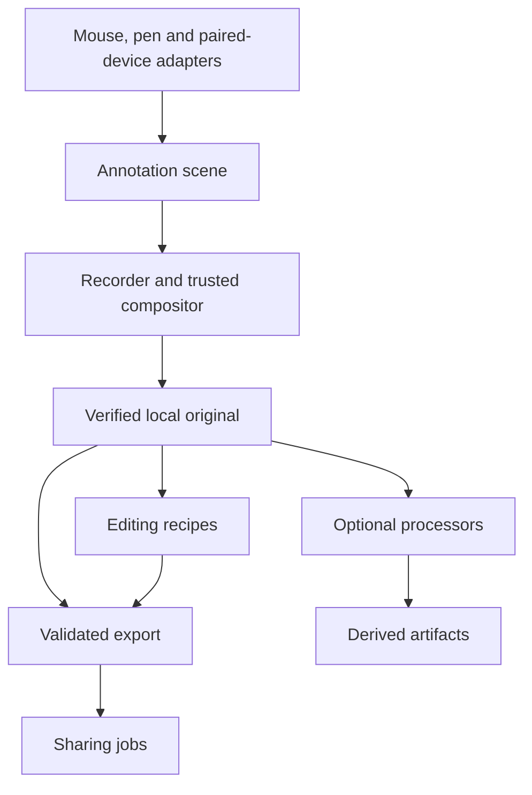

# Optional subsystems, adapters, and extensions

> **Implementation update — September 6, 2026:** Executable code now implements the compact capture, modular tools, local drawing, native iPad companion, editing/destination and diagnostic paths described in [BUILD-PLAN.md](BUILD-PLAN.md). Use [FEATURE-MAP.md](FEATURE-MAP.md) for current feature status and [BUILD-REVIEW.md](BUILD-REVIEW.md) for exact proof. Historical “missing/proposed” statements below describe the earlier baseline unless listed as still open in that ledger. Physical and signing acceptance are not implied.

**Architecture decision requested by Daniel on September 6, 2026; not implemented.** The [current feature map](FEATURE-MAP.md) records the application baseline. This document generalizes the iPad idea: drawing is optional, device input is replaceable, and editing/sharing/processing have separate contracts. An iPad is one adapter, not a dependency of the recorder or the annotation document.

## The product must stand on its own

Clips with every optional extension disabled still records selected native screen/audio inputs, pauses/stops, preserves and recovers supported originals, plays them, and exports a basic local MP4. The compact controls, truthful permission/error state, media validation and diagnostic recorder are product responsibilities. Do not require a plugin installation, external device, account or agent to complete that path.

Drawing is a bundled optional subsystem with a normal mouse/trackpad input adapter. Pencil/iPad, pen tablets and other touch surfaces add input choices when supported. A user who never draws need not pair anything or navigate drawing settings. The basic editor and native Share sheet can remain bundled implementations behind narrow subsystem interfaces; modularity does not require making users install ordinary features separately.

Use three distinct concepts:

- **Subsystem:** an application responsibility such as annotations, edit decisions, or handoff jobs, with its own state and tests.
- **Adapter:** translates an external device, editor, provider or protocol to that subsystem's contract.
- **Plugin:** an optional packaged implementation of a supported contract. A public plugin loader/marketplace is a later distribution decision, not the first task.

Start with trusted first-party modules and explicit registration in the app. Establish interfaces from real integrations. There is no need for a universal workflow engine, arbitrary runtime native-code loading, a plugin dependency resolver or a marketplace now.

## Ownership boundaries

| Owner | Owns | Must not delegate |
|---|---|---|
| Recorder | Capture authorization, selected scope/required inputs, lifecycle, common clock, bounded writer queues, Stop/Quit | A drawing device/editor/agent cannot become the owner of recording state |
| Recording store | Authoritative manifests, committed media, source integrity, recovery, original retention | Extensions never patch manifests or overwrite original segments directly |
| Trusted compositor | Validated camera/annotation scene contributions and matching capture/preview geometry | No arbitrary third-party callback in the per-frame/audio callback path |
| Annotation subsystem | Device-neutral strokes, tools, canvas revisions, undo, target transforms and pause policy | No PencilKit/Wacom/browser transport type in the canonical annotation model |
| Editing subsystem | Versioned edit recipes and references to immutable input artifacts | An editor never changes what the original recording meant |
| Media export service | Baseline MP4, validation of derived media, atomic result publication | Plugin return status alone cannot establish playable or correctly redacted output |
| Handoff subsystem | Chosen destination, job state, retry/deduplication and verified receipts | An upload/provider failure cannot reclassify a saved local original as lost |
| Extension host | Compatibility, granted capabilities, operation budgets, registration/health and adapter identity | A manifest's claimed permissions do not enforce isolation by themselves |
| Diagnostics | Schema validation, host metrics, local evidence and public-report construction | A report-publisher adapter cannot disable sanitization or upload arbitrary raw logs |

The app shell coordinates these owners and offers their actions; it does not hide vendor-specific logic inside CaptureController. The existing `ClipsCore` / `ClipsMedia` / `EidosClips` split is a starting point, not evidence that these boundaries are implemented today.

## Live work and completed-artifact work

Live annotations submit bounded, validated data to the host. They do not perform network waits or file writes in the capture callback. Editing, transcription, render-heavy effects and sharing work on completed immutable inputs in separate cancelable jobs. Prioritize active capture and Stop; pause/reject new background jobs when the resource budget is unavailable. A minimum safe first version can serialize post-processing rather than promising concurrent capture/export before it is measured.

Optional never means silently wrong: a disconnected pen can stop contributing new ink while the accepted ink remains visible; a failed required microphone or a failed privacy protection must trigger the explicit safe interruption/error policy. Do not silently drop requested content, bypass a promised privacy mask, or advertise an incomplete render as complete.

## Contracts to introduce as needed

Names below describe intended interfaces/data, not APIs already present in the repository. Use versioned portable wire data only when crossing a process/device boundary; first-party internal calls can remain ordinary Swift types.

| Contract | Inputs and outputs | Important rule |
|---|---|---|
| DrawingInputAdapter | Capabilities + connection state; input produces InkOperation | Pressure/tilt/hover optional; fixed-width mouse strokes remain valid |
| Annotation scene | Target ID/epoch, stroke IDs, ordered points, tool/style, revision, undo/clear | Host assigns canonical timing/revision; stale scopes and oversized/nonfinite points rejected |
| CapturePreviewSource | Scoped grant → target description and optional preview stream | A local mouse adapter needs no network preview; a paired device receives only the chosen surface |
| EditProvider | Read-only original/derived artifact handles → EditRecipe or validated derivative proposal | Recipe identifies input hashes/revisions and ordered operations; unknown operations remain preserved but unexecuted |
| ArtifactProcessor | Granted completed artifacts + explicit settings → typed derived artifacts and provenance | Transcripts/captions/tasks reference source and edit timeline; no model required by the host |
| DestinationAdapter | Completed export + destination grant → copy/upload/link receipt | Distinguish local bytes, remote storage and recipient access; never infer the latter from the former |
| PresentationContribution | Declarative pointer/shape/canvas/layout contribution | Trusted host renderer enforces bounds; no arbitrary live pixel-processing plugin API initially |
| DiagnosticPublisher | Validated sanitized report + configured destination → verified delivery receipt | Local agent Git bridge is one publisher; raw media/logs unavailable through this contract |

Common job envelope: schema version, operation/request ID, adapter ID/version, source artifact ID/hash, edit revision, granted capabilities, deadline/cancellation and attempt. Common outcomes: accepted, progress with known units, completed with validated receipt, canceled, failed with bounded code, or retryable. A host-owned job state rejects late results for a canceled/stale operation. Retries require idempotency evidence; never blindly retry a provider operation with unknown external outcome.

The baseline clip package must open without the adapter that created a derivative. Keep canonical original media and portable exports independent of vendor SDKs. Store namespaced extension data separately, preserve unknown versions without execution, and leave an explanatory unavailable-edit state when a recipe needs a missing extension. A previously generated MP4 remains playable; never flatten or delete source data merely to remove an extension.

## Drawing without a hardware dependency

Start with [device-neutral drawing](features/drawing.md). Mouse/trackpad, an attached pen device and a paired tablet should all produce the same minimum strokes. Optional capabilities enable pressure or hover; absence gets a deliberate simple fallback rather than disabling the feature. Avoid vendor conditionals in the compositor.

Input, transport, preview and rendering are different boundaries. A local pen need not pair or receive a video stream. An iPad companion needs pairing and preview but still sends the same canonical ink operations. A future Android/browser companion would implement the corresponding transport/input adapter; it does not require changing the recording store. Sidecar is an input-path experiment, not a separate permanent annotation format.

The [iPad plan](features/ipad-ink.md) remains the requested first remote-device case. Native SDK drawing objects may be adapter-local caches, but canonical saved ink must not require an iPad, Apple Pencil or that SDK to read. Compatibility of any specific tablet/driver is unproven until tested.

## Useful optional extension families

| Family | Attractive capabilities | Boundary and priority |
|---|---|---|
| Drawing inputs | iPad/Pencil, attached pen tablet, other touch device/browser; mouse always available | First real adapter boundary; ship useful local annotation even without a companion |
| Presentation tools | Click emphasis, laser, whiteboard, arrows, branded canvas, speaker notes | Declarative scene contributions; notes must stay outside captured scope under include-Clips policy |
| Editing | Cut-middle/stitch, chapter-based edits, editor of choice, reversible edit history | Completed-artifact/recipe subsystem; baseline trim can remain bundled |
| Delivery/viewing | Local folder, user-chosen storage, watchable playback page, access/revoke-aware links | Handoff receipts; storage and recipient playback/access are related but separate contracts |
| Captioning/processing | Local or chosen-model transcription, SRT/VTT, translations, summaries, search, task extraction | Replaceable processor jobs with provenance; no inference vendor in capture |
| Audio finishing | Noise cleanup, leveling, track balance, silence removal | First consider post-processing against retained tracks; live processing needs separate qualification |
| Privacy tools | Masks, blur and redaction before sharing | Output validation and explicit retained-original policy; never bypass a failed protection |
| Workflow/control | User-approved project tagging, completion-event consumer, presentation remote, local CLI/MCP adapter | Scoped commands/events; remote Start is not inherited from permission to draw |
| Diagnostics delivery | Local report folder, existing local-agent Git bridge, later chosen issue/log destination | Same validated public-safe report boundary; no automatic messages or accounts added now |

These are opportunities, not a mandate to implement all of them in 1.0. Capture sources, live encoding, storage integrity and recovery should not become a third-party plugin playground in the first version. If a future source adapter is required, its format/timing/resource contract needs a separate design and physical validation.

## Capabilities, compatibility, and failure containment

For a bundled registry, begin with extension ID/version, contract version/range, kind, capabilities, supported inputs/outputs, and enabled/health state. Avoid a complicated manifest until an actual external installation needs one. Product surfaces stay **Draw**, **Edit**, and **Send to**; show a device/provider choice only when it helps. Setup or update failures belong to the relevant tool, not the recording start screen.

An annotation grant can allow scoped ink and, separately, selected preview; it grants no microphone, arbitrary desktop input, library or sharing authority. An editor gets read-only chosen inputs and an output staging location, not the user's whole library. A sharing adapter gets one selected completed artifact and its configured provider capability. Credentials remain in appropriate local custody and out of generic manifests/logs.

An interface alone is not crash isolation. Trusted first-party in-process modules can still crash or exhaust the app; minimize and measure code on that path. Before supporting untrusted third-party code, introduce an actual separately supervised process with enforced resource and file/network access boundaries, authenticated versioned IPC, deadlines and cleanup of only host-owned tasks. A same-user helper without OS-enforced restrictions is not a security sandbox. Do not weaken hardened runtime/signing or load arbitrary native libraries to make a plugin work. Exact external packaging/sandbox mechanics are a later validated implementation choice.

Disable/install/update outside active use. Pin the adapter version for an operation; reject incompatible contracts before invoking it. Revoking an adapter stops its future access and cancels owned jobs while preserving existing artifacts and accepted annotations. Provide a start-with-extensions-disabled recovery path before external loading ships. Keep compatibility and last successful activation information so a broken extension update can be disabled without migrating or rolling back core recording data.

## Diagnostic responsibility

Every adapter operation carries its extension ID/version and host operation/session IDs through the existing structured log design. Host observations include startup/handshake time, granted capability classes, queue/wait metrics, deadline/cancel response, reconnects, dropped contributions, output validation and disable reason. Distinguish adapter failure from recorder failure. Third-party telemetry cannot suppress host-observed failures or bypass the public-report schema.

No stroke content, transcript, private path, token or raw provider response belongs in public reports. Use the same [DIAGNOSTICS.md](DIAGNOSTICS.md) allowlist and bounded outbox; Git publishing stays an external local-agent responsibility.

## Build sequence and proof

1. Preserve the current recorder behavior and existing media evidence. Introduce only the interfaces needed by the next implemented slice; no speculative package-per-row refactor.
2. Implement device-neutral annotation state/renderer with mouse/trackpad input and no-device/off behavior. Add a deterministic fixture adapter for protocol/geometry tests, then the requested physical iPad adapter. Use that second real input to correct the contract before advertising an SDK.
3. Separate existing basic edit decisions from media rendering and sharing jobs. Keep bundled defaults and a complete local workflow. Prove a second implementation only when selected: e.g. folder delivery plus a chosen link provider.
4. Add completed-artifact processors as a chosen need appears. Validate timeline provenance, cancellation and stale-result handling.
5. Consider externally installable plugins only once concrete third-party demand warrants compatibility, process isolation, signing, update and safe-mode support.

| Case | Acceptance |
|---|---|
| X-V01 All optional modules off | Record/pause/stop/recover/play/basic export succeeds without device/network/agent setup |
| X-V02 Adapter substitution | Equivalent mouse/fixture/physical pen commands yield the same scene; missing optional pressure/hover has a defined fallback |
| X-V03 Slow/disconnected live adapter | Capture remains bounded, accepted ink retained, interruption truthful, no stale stroke applied to new scope/session |
| X-V04 Job failure/cancel/stale completion | Original unchanged; late editor/processor result cannot overwrite a new revision; handoff failure does not block Stop |
| X-V05 Duplicate delivery | One logical side effect/receipt per request; uncertain provider outcome handled explicitly |
| X-V06 Missing/version-mismatched extension | Ordinary originals/exports still open; unsupported edits preserved and explained; no silent destructive conversion |
| X-V07 Capability boundary | Drawing cannot start capture/upload; editor cannot alter originals; report publisher cannot obtain raw logs; real enforcement tested before third-party loading |
| X-V08 Extension crash/resource exhaustion | Once external host exists, deliberately terminate/stall its exact worker and measure recorder survival/resources; protocol mocks alone do not prove containment |
| X-V09 Diagnostic attribution/privacy | Host reports extension/version/stage and validates bounded sanitized output; no adapter can publish its own unchecked report |
| X-V10 Live required/privacy failure | No silent missing required input or unprotected frames; safe terminal state and explicit error, with originals/partial artifacts labeled honestly |

These checks supplement existing V01–V42 and iPad A-V01–A-V07; none is passed by writing this document. Retain physical tests for each actual device, capture configuration and runtime isolation boundary.
